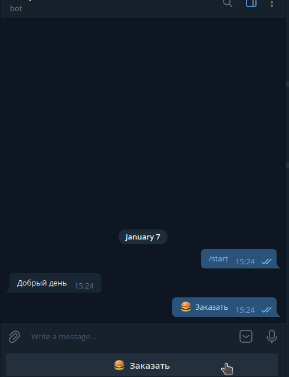

 # Telegram-Sell-Bot

- Golang

# Screenshots

     

# Review

Общие замечания и рекомендации:

1. Не изобретайте базовую структуру проекта, все уже продумано: https://github.com/golang-standards/project-layout
2. Если собрались кому-то что-то показывать, то `README` должен содержать минимальную информацию о проекте: что это и зачем нужно, какие зависимости и как это дело запустить.
3. Не забывайте про `go mod tidy` для поддержания `go.mod` в актуальном виде.
4. Слишком много зависимостей для такого простого проекта. Я еще понимаю наличие библиотек для работы с ТГ и изображениями, но `resty` (пакет `http` содержит все необходимое), `gocron` (ради одной повторяющейся задачи можно было сделать хоть горутину со `sleep`, хоть `time.Ticker`) и `logrus` (стандартный пакет `log` достаточен) явно перебор.
5. Лучше структурируйте переменные окружения. Я бы рекомендовал сначала написать конфиг приложения в `yaml` формате даже если не планируется его использовать. Это позволит понять иерархию настроек. Например, сейчас есть некая переменная `BASE_URL` и что там должен быть адрес сервера приложения МР не очевидно. С другой стороны, есть переменные `EVOTOR_*`, которые также относятся к МР. Так почему бы все эти переменные не сделать с единым префиксом? То есть вместо `BASE_URL` - `EVOTOR_URL`. В `yaml` это были бы свойства одного объекта `evotor`.
6. `CommandRouter` прямо просится быть структурой с методами на каждую команду. И тянуть туда всю структуру `An` кажется излишним. По сути это сервис, который может зависеть от других сервисов.
7. В целом структура пакетов явно требует проработки.
    1. Вполне можно выделить переиспользуемую часть - клиент для API МР, который пойдет в `pkg`. Это как раз часть, с которой я предлагал начать - сделать просто клиент для API.
    2. Само приложение по сути состоит из 2 больших частей - инфраструктура и логика. К инфраструктуре относится веб-сервер, база данных и, может быть, клиент ТГ. К логике - сервисы и репозитории самого бота.
    3. В боте явно можно выделить модули для работы с меню, с заказами и состоянием. Соответственно, у них могут быть свои модели и репозитории для доступа к БД. Это сформирует 3 разных пакета.
    4. В рамках модулей я обычно группирую код по назначению, например, `models.go` для моделей БД, `domain.go` для публичных моделей, `repositories.go` для репозиториев и т.д. Если кода в одном файле становится много - тогда уже разделяю. Похожий принцип распространен в Python (см. например Django).